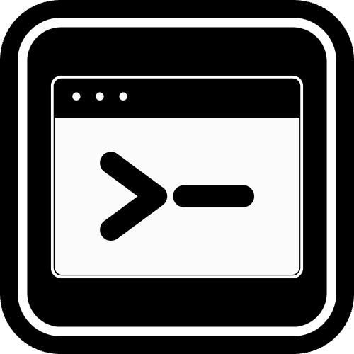

<div align="center">
  

  # Command Shelf

  **Your Ultimate Command Line Companion**

  Command Shelf is the productivity booster you didn't know you needed. Say goodbye to forgotten commands and endless Google searches. Store, organize, and access your essential terminal commands instantly, right from your menu bar. It's not just a cheat sheet; it's your personal command center.
</div>

---

## ✨ Features

- **🚀 Instant Access**: Toggle your command palette anywhere with `Cmd+Shift+D`. It's always there when you need it, and out of your way when you don't.
- **🔍 Smart Search**: Find the exact command you need in milliseconds. No more scrolling through history.
- **📋 One-Click Copy**: Click any command to copy it directly to your clipboard, ready to paste.
- **🛡️ Safe Pasting**: Copied commands are automatically prefixed with `#` so you can review them before execution.
- **🎨 Beautiful UI**: A modern, dark-mode interface that looks right at home on your Mac.
- **☁️ Auto-Sync**: Keeps your command library up-to-date automatically.
- **➕ Custom Commands**: Add your own frequently used snippets and scripts.

---

# 📖 User Guide

## 🚀 Installation (via Homebrew)

To install Command Shelf, run the following commands in your terminal:

```bash
# 1. Add the custom tap
brew tap tharunShiv/homebrew-cs

# 2. Install the app
brew install --cask command-shelf
```

### ⚠️ "App is Damaged" / "Cannot be opened" Error

Since this app is not notarized by Apple yet, macOS may block it. To fix this, run:

```bash
xattr -cr "/Applications/Command Shelf.app"
```

## 🎮 How to Use

1.  **Open/Close:** Use the hotkey `Command+Shift+D` to toggle the app.
2.  **Search:** Type to search for commands.
3.  **Copy:** Press `Enter` or click on a command to copy it to your clipboard.
    *   *Note:* The copied command will be prefixed with a comment (e.g., `# `) to prevent accidental execution when pasting into a terminal.

## 🔄 How to Update

If a new version is released, update your local copy by running:

```bash
# 1. Update Homebrew's database
brew update

# 2. Upgrade the app
brew upgrade command-shelf
```

## 🗑️ Uninstallation

```bash
brew uninstall --cask command-shelf
```

---

# 👨‍💻 Developer Guide

## Running the Code Locally

1.  **Install dependencies:**
    ```bash
    npm i
    ```

2.  **Start Development Server:**
    ```bash
    npm run dev
    ```
    This starts Vite and Electron together. The main window launches fullscreen. A small popup can be toggled from the tray icon or with the shortcut `Command+Shift+D`.

## Build macOS App

To package a macOS DMG using electron-builder:

```bash
npm run dist
```

## Clean Build Artifacts

```bash
rm -rf node_modules dist electron/*.js && npm cache clean --force
```

## Releasing a New Version

*This section is for the maintainer.*

### Step 1: Create a Release
1.  Build the new `.dmg` file.
2.  Create a new Release on the [GitHub Repository](https://github.com/tharunShiv/command-shelf).
3.  Upload the `.dmg` as an asset.
4.  Copy the download link of the new `.dmg`.

### Step 2: Get the SHA256 Checksum
Run this command (replace URL with your new link):
```bash
curl -L <NEW_DMG_URL> | shasum -a 256
```

### Step 3: Update the Cask
1.  Open `Casks/command-shelf.rb` in the homebrew tap repository.
2.  Update the `version` number.
3.  Update the `sha256` string.
4.  **Important:** Ensure the `url` logic matches the new filename.

### Step 4: Push Changes
```bash
git add .
git commit -m "Upgrade command-shelf to vX.X.X"
git push
```

---

# 🛠️ How it Works

Command Shelf is built using **Electron**, combining the power of web technologies (React, TypeScript, Tailwind CSS) with native system capabilities.

## 🏗️ High-Level Architecture

The application consists of two main processes:

1.  **Main Process (Node.js)**:
    *   Manages the application lifecycle, windows, and system tray.
    *   Handles global shortcuts (`Cmd+Shift+D`).
    *   Manages the SQLite database (`better-sqlite3`).
    *   Performs data synchronization with the remote source.
    *   Communicates with the renderer via **IPC (Inter-Process Communication)**.

2.  **Renderer Process (React + Vite)**:
    *   Renders the UI (Search bar, Command list, Settings).
    *   Handles user interactions and animations.
    *   Requests data from the Main Process using `ipcRenderer`.

## ⚙️ Low-Level Details

### 💾 Data Storage
Commands are stored locally in a **SQLite database** (`commands.sqlite`) located in the user's application data directory. This ensures:
*   **Instant Search**: No network latency when searching for commands.
*   **Offline Access**: The app works perfectly without an internet connection.
*   **Persistence**: Custom commands and settings are saved securely.

### 🔄 Synchronization Engine
To keep the command library up-to-date, the app employs a "pull-based" sync mechanism:
1.  **Version Check**: On startup, the Main Process fetches a lightweight JSON file from a GitHub repository to check for the latest data version.
2.  **Smart Update**: If the remote version is newer than the local version, the app downloads the full command dataset.
3.  **Atomic Update**: The new data is inserted into the SQLite database in a single transaction, ensuring data integrity.

### 🔍 Search Implementation
*   The Main Process exposes a `get-all-commands` IPC handler.
*   The Renderer fetches all commands into memory on load (efficient for datasets < 10k items).
*   **Fuse.js** (or similar logic) is used in the frontend for fuzzy searching, allowing you to find commands even with typos or partial matches.

### 🖥️ Window Management
*   **Tray-Only App**: The app runs primarily in the background.
*   **Popup Window**: The search interface is a frameless, transparent window that is programmatically positioned and shown/hidden.
*   **Focus Management**: Special care is taken to handle focus switching between the app and other windows to provide a seamless "Spotlight-like" experience.

## 🔗 Ecosystem & Repositories

Command Shelf is composed of three interconnected parts:

1.  **[Command Shelf App](https://github.com/tharunShiv/command-shelf)** (This Repo)
    *   The main application code (Electron, React).
    *   **[Releases Page](https://github.com/tharunShiv/command-shelf/releases)**: Where the compiled `.dmg` files are hosted. If you don't use Homebrew, you can download the app directly from here.

2.  **[Data Source](https://github.com/tharunShiv/command-shelf-data-source)**
    *   Hosts the `commands.json` file which serves as the "Source of Truth".
    *   The app periodically checks this repository for updates. When new commands are added here, your app will automatically download them.

3.  **[Homebrew Tap](https://github.com/tharunShiv/homebrew-cs)**
    *   Contains the Cask formula (`command-shelf.rb`) for Homebrew.
    *   It points to the `.dmg` file in the **Releases** page, allowing users to install and update the app with `brew install command-shelf`.

### 🔄 How they link together:
*   **Developer** pushes code to **App Repo** -> Builds `.dmg` -> Uploads to **Releases**.
*   **Developer** updates **Homebrew Tap** to point to the new `.dmg`.
*   **Developer** updates `commands_version.json` in **Data Source**:
    *   `latestVersion`: Incremented when **commands** are added/changed.
    *   `latestAppVersion`: Updated when a new **app version** is released.
*   **User** runs `brew install` -> Homebrew fetches `.dmg` from **Releases**.
*   **User** runs App -> App checks `commands_version.json`:
    *   If `latestVersion` > local version -> Downloads new commands.
    *   If `latestAppVersion` > current app version -> Notifies user of update.